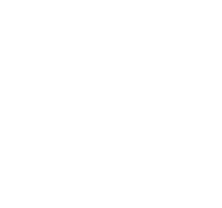

<div align="center">



# NEXORA

### Одностраничник студии. Семь миров за один скролл. Кинематика, понты, частицы.

<sub><i>A single-page cinematic studio site. Seven worlds in one scroll.</i></sub>

[](https://nexora-6b0e9.web.app)


<br />

<a href="https://nexora-6b0e9.web.app">
  
</a>

</div>

---

## Привет, Матвей 👋

Это сайт студии **NEXORA**. **ЛУЧШАЯ СТУДИЯ** на этой планете, эффекты тут не фейк, всё по-настоящему. Семь секций, у каждой свой характер:

- **Hero.** Лого пульсирует как сердце. На каждом втором ударе с его **настоящего контура** отрывает частицы (через `path.getPointAtLength()`, не из рандомной точки), плюс **псевдо-3D из пяти SVG-слоёв** с разным rotation от позиции мышки. Фоновая сетка точек реагирует гравитационными волнами на каждый "тук".
- **Mission.** Карточка с миссией плюс четыре анимированных счётчика. Раньше тут была хуйня со scroll-driven `scale + rotate`, которая блюрила glass-слой при каждом тике скролла. Снёс, теперь чисто.
- **Services.** Пятиполосный аккордеон. Hover открывает row, показывает glyph, плюсик крутится на 45°.
- **Industries.** Бенто из стеклянных карточек с 3D-тильтом по мыши. Иконки-точки при наведении **собираются в наш лого** (60 точек, каждая морфится по углу к ближайшей точке логотипа).
- **Portfolio ×7.** Sticky-вьюпорт. Вертикальный скролл превращается в горизонтальный track. Семь кейсов, у каждого своя анимация: `Datoo` (геоданные на карте), `ABIR Holdings` (industrial digital twin), `CyberBook` (гейм-компаньон плюс custom cursor), `Myco.OS` (грибы растут под курсором), `Sidus Heroes` (Web3 планетарная система), `City Expo` (дома вырастают под мышкой), `Reel.AI` (AI pipeline с режиссёрским монитором и кинолентой).
- **Contact.** Форма плюс магнитная кнопка, которая прыгает к курсору.

> **EN:** This is the NEXORA studio site. Seven sections, each with its own behavior: heartbeat logo with **contour-anchored particle bursts** (via `path.getPointAtLength`), pseudo-3D logo from five stacked SVG layers, mission card on a unified glass system, accordion services, 3D-tilted bento Industries with dot-grid icons that morph into the logo, a sticky horizontal-scroll portfolio of seven cases each with its own visualization surface, plus a magnetic contact form.

---

## Стек, ёбана

Без сборки, без бандлера, без npm. Открыл `index.html`, оно работает.

| | |
|---|---|
| **JSX в браузере** | Babel Standalone компилит на лету. React 18 плюс Framer Motion 11, оба с CDN. |
| **Стили** | Tailwind CDN плюс `styles.css` со своими утилитарными классами (`.glass`, `.glass-soft`, `.sweep`, `.lift`, `.nx-glass`). Один визуальный язык на весь сайт. |
| **Анимации** | Framer Motion для declarative-входов. **Canvas 2D** для фоновых точек и bezier-волн. **Raw `requestAnimationFrame`** для всего, что должно крутиться 60 fps без React-рендеров (heartbeat, частицы, mouse-followers, mushroom growth, building scaleY). |
| **3D / SVG** | Никаких WebGL и Three.js, **псевдо-3D через стопку SVG-слоёв** с CSS-переменными `--orb-rx` / `--orb-ry` от позиции мышки. Частицы рождаются **на контуре** через `getPointAtLength()` плюс `getScreenCTM()` для перевода в экранные координаты. |
| **Pixel-perfect grid** | Левая кромка карточек в Portfolio вычисляется **в рантайме** из `document.querySelector('.container').getBoundingClientRect().left`, потому что `calc((100vw - min(1280px, 92vw)) / 2)` отстаёт от `.container { margin: 0 auto }` на полширины скроллбара (~7-15 px). Битый час на это убил. |
| **Хостинг** | Firebase Hosting. Статика, ноль серверов. |

> **EN:** No build, no bundler, no npm. Open `index.html` and it runs. React 18 plus Framer Motion 11 via CDN. Babel Standalone compiles JSX in the browser. Tailwind CDN plus custom utility classes for a unified glass system. Framer Motion for declarative entrances, Canvas 2D for background dots and bezier waves, raw `requestAnimationFrame` for 60 fps work. Pseudo-3D from stacked SVG layers driven by CSS vars; particles emitted via `path.getPointAtLength` for contour-anchored bursts. Portfolio grid alignment measured at runtime from `getBoundingClientRect` because `calc(min(), vw)` drifts by half a scrollbar against `margin: 0 auto`. Firebase Hosting.

---

## Карта файлов

```
index.html ─► hooks.jsx                  общий анимационный бас, intersection, magnetic
             motion-primitives.jsx       FadeIn, RevealText, SectionHead
             glass-nav.jsx               навигация, логотип-глиф
             environment.jsx             фон, dot-grid canvas, волны, виньетка
             hero.jsx                    верхний экран, сердцебиение, частицы, 3D-стек
             sections-a.jsx              маркее, миссия, услуги
             sections-b.jsx              индастрис бенто, контактная форма
             portfolio-surfaces2.jsx     Myco / Sidus / CityExpo surfaces
             portfolio-surfaces3.jsx     Reel.AI surface
             portfolio.jsx               Portfolio + Datoo / ABIR / CyberBook
             app.jsx                     склейка всего
```

Каждая surface-карточка портфолио тащит мышку через **трёхъярусный `useSurfaceMouse*`**:

1. **CSS-переменные** на горячем пути → 60 fps без единого React render
2. **React state с epsilon-throttle** для тяжёлых SVG-детей (рендер только когда мышка реально сдвинулась >0.3%)
3. **`subscribeRaw` канал** для прямого DOM-апдейта спрайтов и кастомных курсоров (мимо React, сразу в `setAttribute('transform', ...)`)

Плюс lerp-смузинг на mouseenter/mouseleave чтобы карточка не **стрикала** к мышке при заходе курсора в её область (был этот парадокс с "magnetic snap" по всему сайту, фиксил централизованно).

> **EN:** Each portfolio surface uses a three-tier mouse tracker: CSS variables on the hot path (60 fps, zero React renders), epsilon-throttled React state for layout-driving SVG children, plus a `subscribeRaw` channel for direct-DOM cursor-followers. Lerp-smoothing on mouseenter/leave kills the magnetic snap-to-cursor across every surface.

---

## По-братски

Матвей, шо тебе сказать. Код собран с **дикой помощью нейронок**, итераций было дохуя. Я по скриншотам гонял ассистента "нет, не так, передвинь, переделай, что за параша, почему так криво". Не Apple-grade, не флагман, не Higgsfield.

Но:
- **Всё бежит в проде.** Открой live, оно живое.
- **Архитектура расписана выше**, поковыряешься за пару часов, поймёшь что где.
- **Файлы маленькие** (самый большой `portfolio.jsx` ≈ 50 KB), без бандлера, всё видно глазами в DevTools без source maps.
- **Один визуальный язык**: glass-утилиты унифицированы, FadeIn один на всех, mouse-tracker один на всех portfolio surfaces.

Если что-то нашёл стрёмное, это либо нейронка решила что так красиво, либо я задолбался на восьмой итерации и оставил как есть. Бей не сильно, **передаю как есть**.

> **EN:** Matvey, real talk. Built with heavy AI assistance, lots of iterations against visual feedback. Not flagship-quality, not Apple-grade. **But:** everything runs in production, architecture is documented above, files are small (max ≈50 KB), no bundler, you can read it all in DevTools without sourcemaps. One visual language across the site. If something looks rough, it's either the AI's aesthetic choice or me giving up after iteration eight. Handed over as-is.

---

<div align="center">

**Built by MAX 256.**

<sub>Лучший прогер на планете, это Матвей. Не шутка.</sub>

</div>
